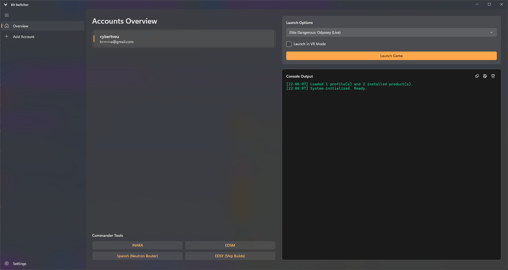

# ED Switcher

A modern, fast, and native account switcher for **Elite Dangerous**, built with C#, WinUI 3, and .NET 8.

It acts as a lightweight, Fluent Design GUI front-end for [min-ed-launcher](https://github.com/Rfvgyhn/min-ed-launcher) (using a [custom fork](https://github.com/Gitveu/min-ed-launcher_consfix) to prevent console redirection crashes): managing multiple Frontier account credential files (including first-time sign-in with email 2FA) and spawning the real `MinEdLauncher.exe` to perform the actual game update and launch.

## Features

- **Multi-Account Management**: Easily switch between multiple Elite Dangerous accounts without re-entering passwords or 2FA codes.
- **Modern Windows Native UI**: Built with WinUI 3 for a beautiful, responsive, and native Windows 11/10 experience, complete with Mica/Acrylic transparency.
- **Native 2FA Support**: Handles Frontier's 2FA email verification natively within the UI.
- **MinEdLauncher Integration**: Generates fully compatible `.cred` files with DPAPI encryption so `MinEdLauncher` can read them directly and launch the game silently.
- **Accurate Machine Spoofing**: Perfectly replicates the exact F#-based `MachineId` generation algorithm used by `MinEdLauncher`.

## Prerequisites

1. **Elite Dangerous** installed on your system.
2. **[min-ed-launcher (Console Fix Fork)](https://github.com/Gitveu/min-ed-launcher_consfix/releases)**.
   - *Note: You must use this specific fork! The original `min-ed-launcher` crashes when run outside of a standard console (which happens when this GUI app redirects its output).*
   - Place `MinEdLauncher.exe` in your Elite Dangerous install directory, next to `EDLaunch.exe`.

## Development / Building from Source

This project is built using C# and the Windows App SDK (WinUI 3).

**Prerequisites:**
- [Visual Studio 2022](https://visualstudio.microsoft.com/) (Community or higher)
- **.NET 8.0 SDK**
- **Windows App SDK** workload installed in Visual Studio.

**Build Instructions:**
1. Open `EDAccountSwitcher.sln` in Visual Studio 2022.
2. Ensure the startup project is set to `EDAccountSwitcher`.
3. Set the build configuration to `Release` and architecture to `x64`.
4. Build the solution.

To create a portable `.exe` file without the need for MSIX packaging, use the "Publish" feature targeting a folder with a "Self-contained" deployment mode.

## How it works (Technical Details)

This app ports the relevant `min-ed-launcher` internals into C#:

- **Credential files**: Fully compatible with `min-ed-launcher`. Stored in `%LOCALAPPDATA%\min-ed-launcher\.frontier-<profile-lowercased>.cred`. It contains three lines: plaintext email, encrypted password, encrypted machine token.
- **DPAPI Encryption**: Encryption is UTF-16LE → DPAPI with `CryptProtectData` and the salt reflected from `ClientSupport.dll` (found in the ED install dir) → Base64. Because the same salt and Windows Data Protection API (DPAPI) are used, cred files written by this app are perfectly readable by `min-ed-launcher`.
- **Machine ID Algorithm**: Matches `min-ed-launcher` exactly. It computes a SHA1 hash over the concatenation of `HKLM\SOFTWARE\Microsoft\Cryptography\MachineGuid` and `HKCU\SOFTWARE\Frontier Developments\Cryptography\MachineGuid` (which is created if missing), converts to hex, and truncates to 16 lowercase characters.
- **Frontier API**: Talks to `https://api.zaonce.net` exactly like `min-ed-launcher`. It fetches time from `GET /1.1/server/time`, authenticates via `POST /3.0/user/frontier/auth`, and completes 2FA via `POST /3.0/user/frontier/token` to retrieve the final machine token.
- **Launching**: Spawns `MinEdLauncher.exe /frontier <profile> /autorun /<product-filter> /autoquit` with the ED install dir as the working directory.

## Acknowledgments

This project would have been impossible without the work of other people. Special thanks to:

- [rfvgyhn](https://github.com/rfvgyhn) for creating [min-ed-launcher](https://github.com/rfvgyhn/min-ed-launcher) — the backbone of fast, headless ED launching and authorization.
- [thomas9120](https://github.com/thomas9120) for the inspiration and foundation from the original [ED-Account-Switcher](https://github.com/thomas9120/ED-Account-Switcher).

## License

MIT License
